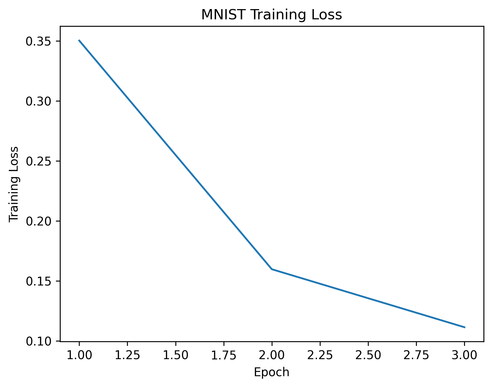

# DNNKit

DNNKit is a lightweight PyTorch framework for reproducible deep learning experiments, with support for modular models, training pipelines, evaluation, documentation, and publication-ready research workflows.
# DNNKit


DNNKit is a lightweight PyTorch framework for reproducible deep learning experiments.
## Features

- PyTorch-based training and evaluation
- Reproducible experiment structure
- Modular model and data components
- Unit testing with pytest
- GitHub Actions CI
- Academic paper scaffold
- Example MNIST benchmark pipeline

## Installation

```bash
pip install -e .
pip install -r requirements-dev.txt
## Example Training Curve


